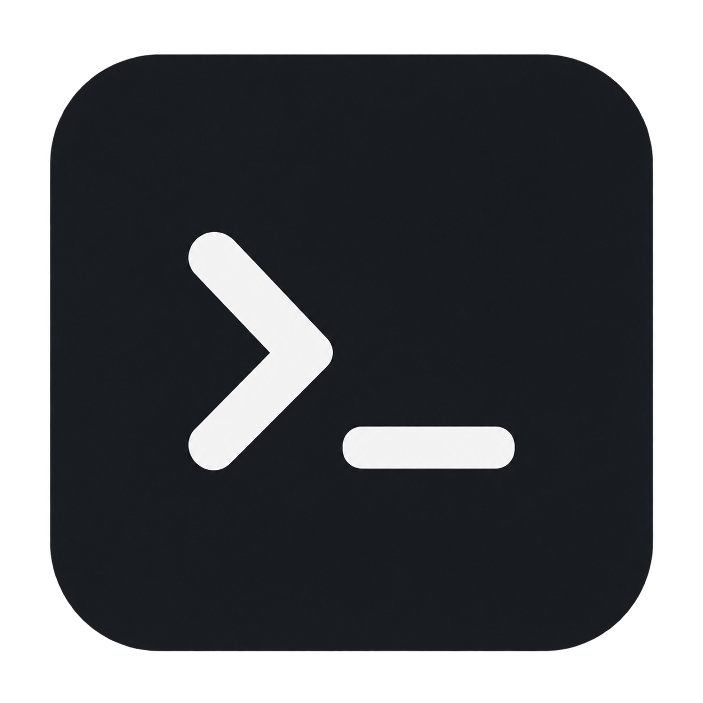

# Aden Guo

Systems · GIS · Web · Agentic CLI

### Links

<table>
  <tr>
    <td align="center" width="150">
      <a href="https://adenguo.com">
         
        Portfolio
      </a>
    </td>
    <td align="center" width="150">
      <a href="https://glass-atlas-production.up.railway.app/">
         
        Glass Atlas
      </a>
    </td>
  </tr>
</table>

[LinkedIn ↗](https://linkedin.com/in/aden-guo-b39743362)

### Stack

| | |
| :--- | :--- |
| Languages | Python · TypeScript · JavaScript · Rust · Ruby · Go |
| Web & frameworks | SvelteKit · React · Next.js · Node.js · FastAPI · Bun · Tauri · Drizzle · Rails · Playwright · WebAssembly |
| Data | PostgreSQL · SQLite · Redis |
| Cloud | Railway · Neon · Supabase · Azure · AWS S3 · Resend |
| AI | Anthropic · OpenAI · Vercel AI SDK · OpenRouter · LangSmith |
| Systems & tools | Linux · Docker · Bash · Git · Azure DevOps |

### Contributions

