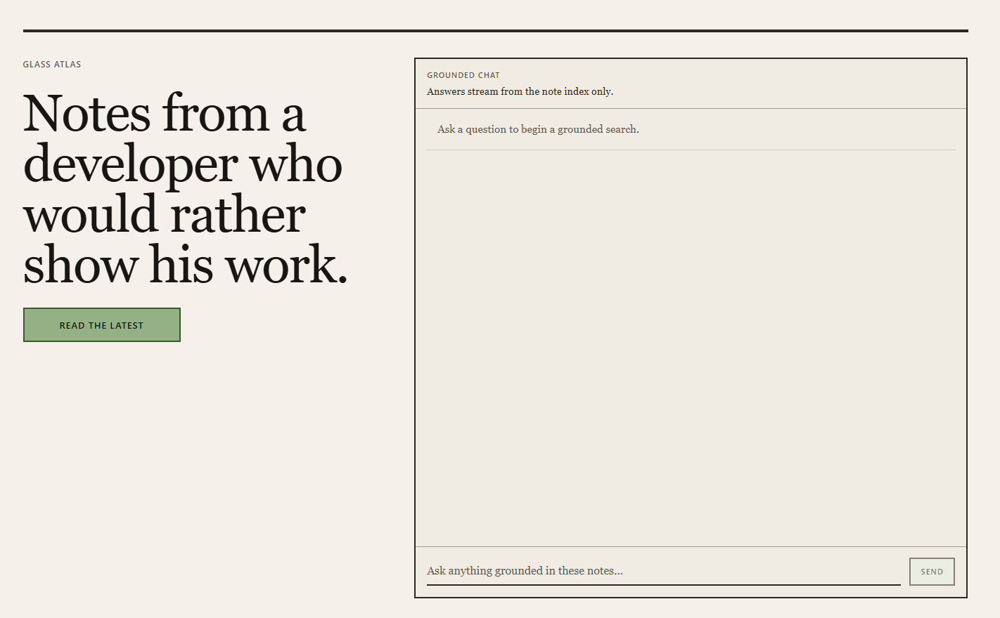

  

 

<table align="center">
  <tr>
    <td valign="middle" width="70%">
      

        Builder at the intersection of <strong>maps</strong>, <strong>systems</strong>, and <strong>intelligent tooling</strong>. 
        I make things run fast, feel smooth, and think for themselves.
      

    </td>
    <td valign="middle" align="center" width="30%">
      
    </td>
  </tr>
</table>

 

---

### ✍️ Glass Atlas

 

A personal knowledge site where I think out loud about systems, tooling, and whatever I'm currently building.
Notes are connected, semantically indexed, and searchable — so instead of a dead archive, there's a
**grounded AI chat** that lets you dig into everything I've written, answered directly from the source.

No newsletters. No algorithms. Just the work.

**[Explore the notes →](https://glass-atlas-production.up.railway.app/)**

---

### Tech Stack

#### 💻 Languages

#### 🌐 Web & Frameworks

#### 🗃️ Databases

#### ☁️ Services & Platforms

#### 🤖 AI & LLMs

#### ⚙️ Systems & DevOps

---

### Stats

  
  

 

